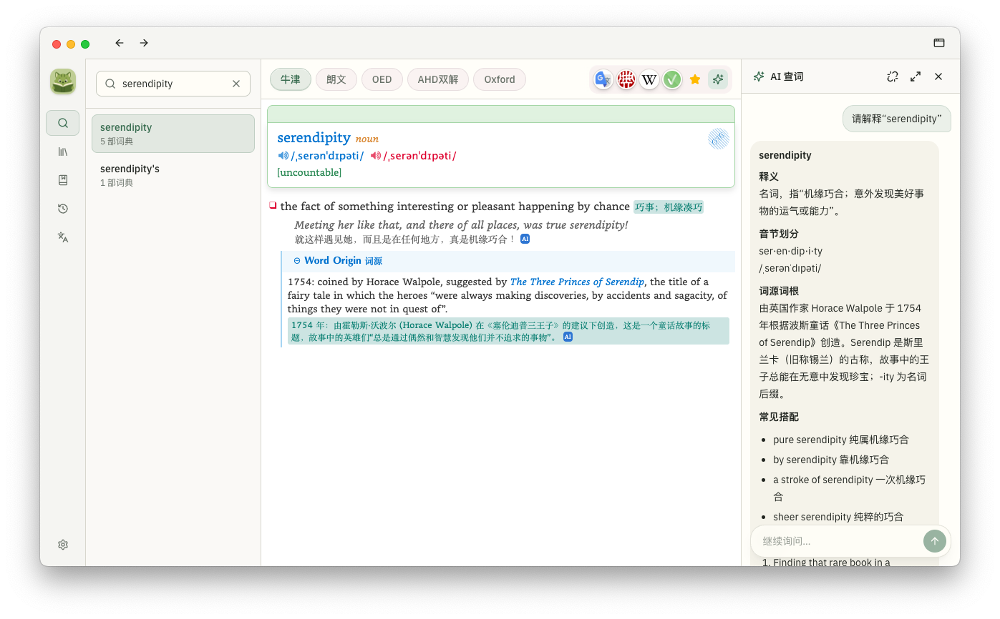
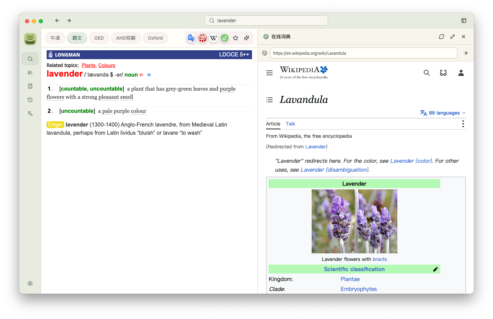
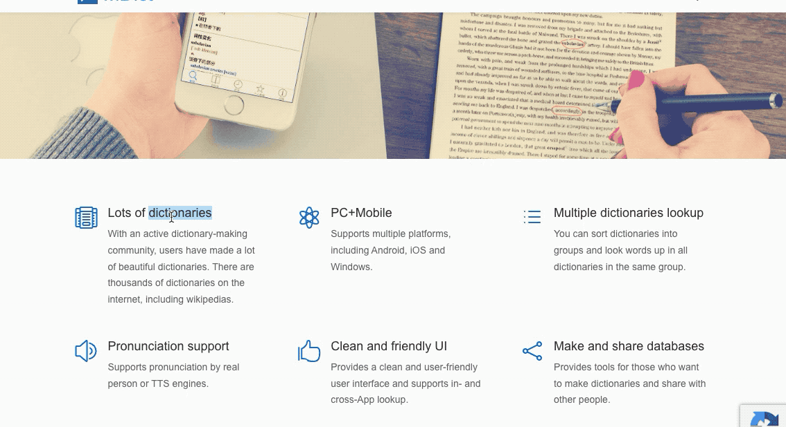
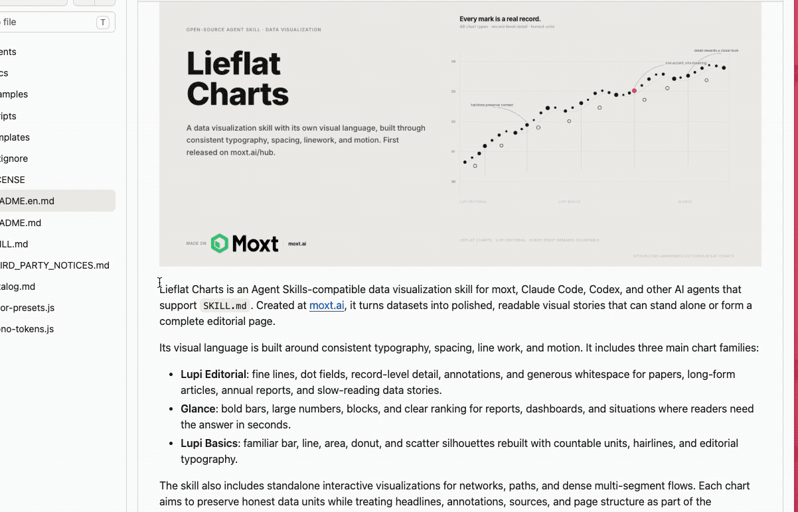
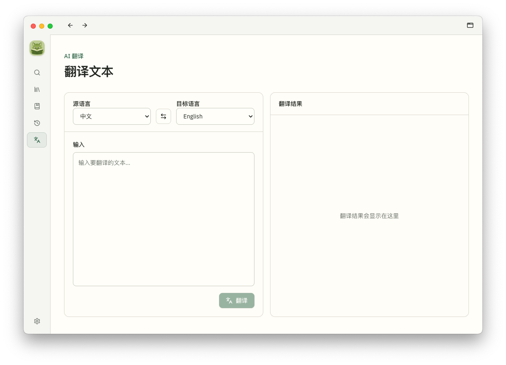
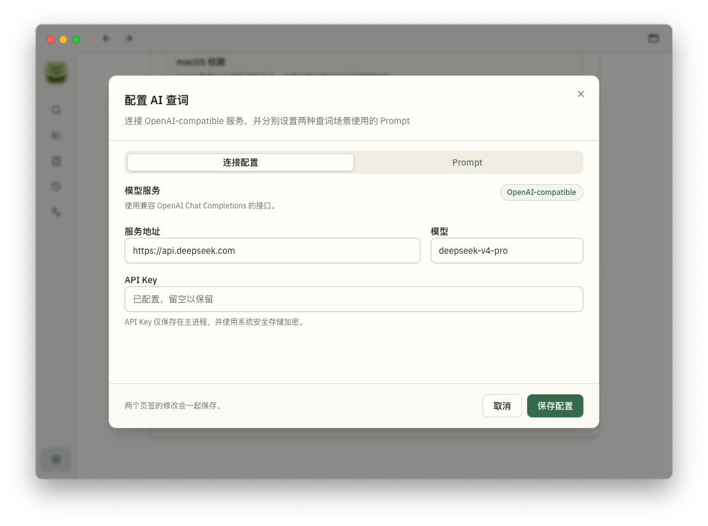
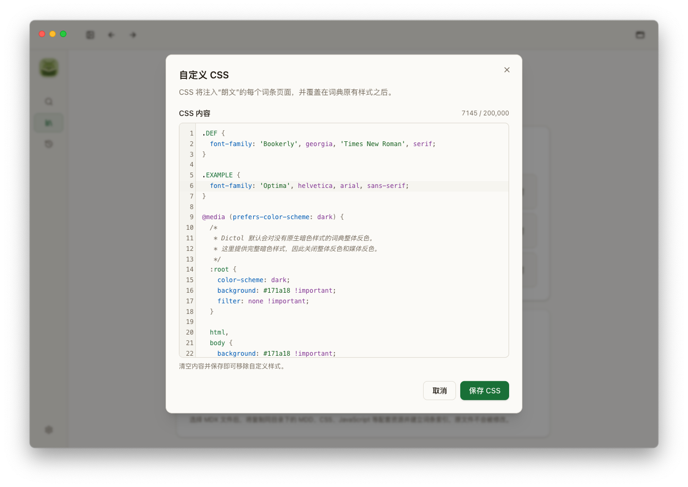

# Dictol

一款基于 Electron 的桌面词典应用。Dictol 将本地 MDX/MDD 词典、在线词典和可选的 AI 服务放进同一个查词工作区，并提供跨应用划词、文本翻译、生词本和查询历史等功能。

词条内容由项目内 Rust 原生模块解析，并在独立的 `WebContentsView` 中呈现词典自带的 HTML、CSS、图片、音频与 JavaScript 交互。

> Dictol 不随安装包分发本地词典。AI 功能同样是可选的，需要用户自行配置 OpenAI-compatible 服务。

## 功能特性

### 本地词典

- 导入 MDX 及同目录中的 MDD、CSS、JavaScript 等关联资源；当前主要使用 MDX 2.0 词典验证
- 使用 Rust 原生模块解析词典，并呈现图片、音频、内部链接及词典自带交互
- 同一词条支持多词典结果切换，词典顺序可拖动调整
- 可为每部词典编写自定义 CSS，覆盖原有样式并分别适配浅色、深色模式

### 搜索与在线词典

- 前缀搜索、实时候选词、最近查询历史（最多保留 200 条）
- 本地词典没有结果时，仍可继续使用在线词典或 AI 查词
- 可配置带 `%s` 占位符的在线词典 URL，并在词条右侧直接浏览网站内容
- 在线词典支持排序、跟随当前查询以及侧边栏宽度调节

### AI 查词与翻译

- 连接 OpenAI-compatible 服务，可分别配置服务地址、模型和场景 Prompt
- 在词条右侧进行 AI 查词和连续追问，也可以让侧边栏跟随当前查询
- 对其他应用中选中的文本生成一次性 AI 解释
- 独立的 AI 翻译工作区，支持选择、互换源语言和目标语言
- AI 结果支持 Markdown、表格、代码块和 LaTeX 数学公式
- API Key 仅交给主进程，并使用系统安全存储加密

### 跨应用取词

- 选择其他应用中的文本后显示浮动工具栏，可查词、AI 解释、复制或打开网页搜索
- 解释浮窗支持在多部本地词典之间切换，并可直接收藏到默认生词本
- 支持全局快捷键主动读取当前选区
- 实时划词可以配置排除程序列表

### 生词本

- 在主窗口或解释浮窗中收藏单词，并使用星级标记
- 创建、重命名和删除自定义生词本，支持搜索、分页和批量移动
- 支持批量导入单词，并将全部、指定生词本或选中条目导出为 Excel
- 使用内置本地词库补充音标、释义和翻译，不调用 AI 服务

## macOS 权限

Dictol 会按功能引导用户开启必要的系统权限：

- **辅助功能**：用于获取其他应用中当前所选的文本
- **输入监控**：用于感知划词结束和弹窗外点击，改善划词工具栏与解释浮窗体验；Dictol 不保存或上传键盘输入

修改权限后需要退出并重新打开 Dictol。

## 截图

### 本地词典与 AI 查词并排显示

<p align="center">
  
</p>

### 在线词典

<p align="center">
  
</p>

### 划词工具栏与多词典解释浮窗

<p align="center">
  
</p>

### 选中文本后使用 AI 解释

<p align="center">
  
</p>

### AI 翻译

<p align="center">
  
</p>

### 配置 AI 服务

<p align="center">
  
</p>

### 自定义词典 CSS

<p align="center">
  
</p>

## 技术栈

| 层       | 技术                                                                                   |
| -------- | -------------------------------------------------------------------------------------- |
| 桌面框架 | Electron 43 + electron-vite 5                                                          |
| 前端     | React 19、TypeScript、Tailwind CSS 4、shadcn/ui、React Router、TanStack Query、Zustand |
| 词典解析 | Rust `native/mdict`（v1/v2/v3），经 NAPI-RS 封装为 `@dictol/mdict-native`              |
| 本地存储 | SQLite（better-sqlite3）+ Drizzle ORM                                                  |
| 打包     | electron-builder（macOS / Windows / Linux）                                            |

## 开发

```bash
nvm use            # Node 22.12+（.nvmrc 固定 22.15.1）
npm install
npm run dev        # 构建原生模块并启动开发模式
```

## 常用命令

```bash
npm run typecheck       # TypeScript 类型检查（node + web）
npm run lint            # ESLint
npm run build           # 原生构建 + 类型检查 + electron-vite 构建
npm run build:mac       # 打包 macOS
npm run build:win       # 打包 Windows
npm run build:linux     # 打包 Linux
npm run native:test     # Rust Node-API 测试
npm run db:generate     # Drizzle 迁移生成
```
