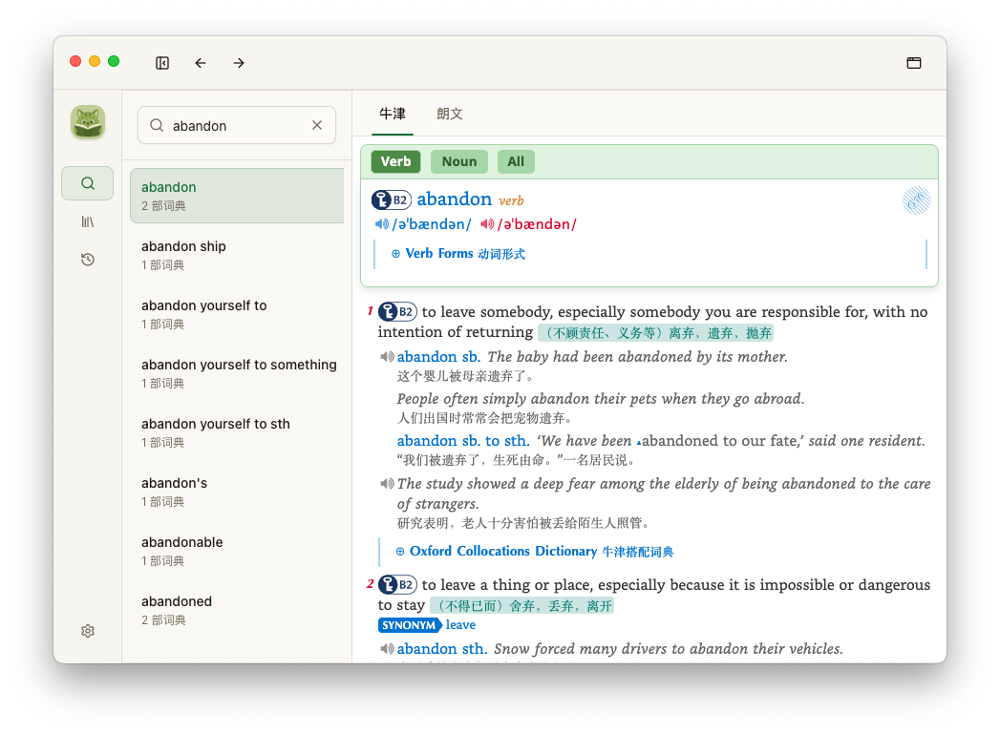
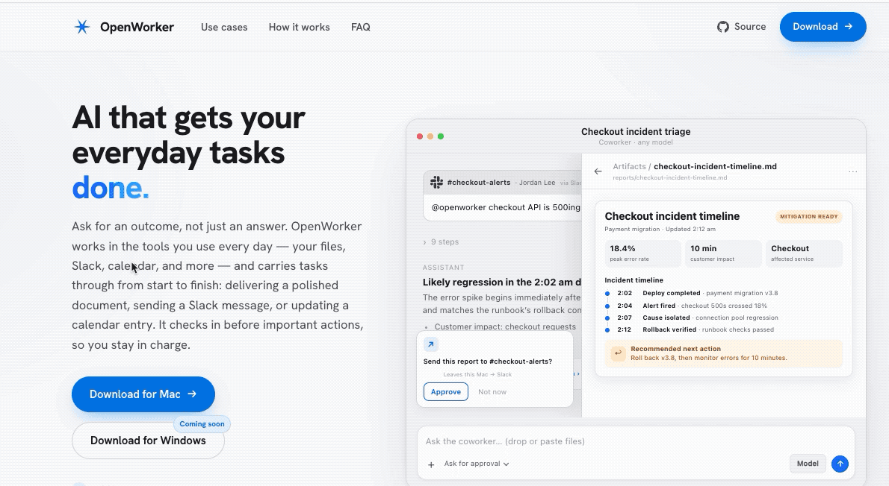

# Dictol

一款基于 Electron 的桌面词典应用，支持导入 MDX/MDD 词典，提供查词、划词查询。词条内容由项目内 Rust 原生模块解析，忠实呈现词典自带的 HTML、CSS、图片、音频与 JavaScript 交互。

> 应用仅提供用户自行导入能力，不随安装包分发任何词典。

## 功能特性

- **MDX/MDD 词典导入**：导入后自动复制同目录的 MDD/CSS/JS 资源（目前只测试了 2.0 版本格式）
- **快速搜索**：前缀范围查询、实时建议、最近查询历史（最多 200 条）
- **忠实渲染**：词条在独立 `WebContentsView` 中运行，支持词条内链接跳转
- **自定义 CSS**：支持为每部词典配置自定义 CSS，自由调整排版、字体、配色等样式
- **划词查询**：跨软件划词查询(可配置排除程序列表)，浮动工具栏 + 解释浮窗
- **多词典 Tabs**：同一词条在不同词典间的结果切换

## 截图

**主窗口**



**自定义 CSS 渲染**


**划词工具栏**



## 技术栈

| 层 | 技术 |
|---|---|
| 桌面框架 | Electron 43 + electron-vite 5 |
| 前端 | React 19、TypeScript、Tailwind CSS 4、shadcn/ui、React Router、TanStack Query、Zustand |
| 词典解析 | Rust `native/mdict`（v1/v2/v3），经 NAPI-RS 封装为 `@dictol/mdict-native` |
| 本地存储 | SQLite（better-sqlite3）+ Drizzle ORM |
| 打包 | electron-builder（macOS / Windows / Linux） |

## 开发

```bash
nvm use            # Node 22.12+（.nvmrc 固定 22.15.1）
npm install
npm run dev        # 构建原生模块并启动开发模式
```

## 常用命令

```bash
npm run typecheck       # TypeScript 类型检查（node + web）
npm run lint            # ESLint
npm run build           # 原生构建 + 类型检查 + electron-vite 构建
npm run build:mac       # 打包 macOS
npm run build:win       # 打包 Windows
npm run build:linux     # 打包 Linux
npm run native:test     # Rust Node-API 测试
npm run db:generate     # Drizzle 迁移生成
```
