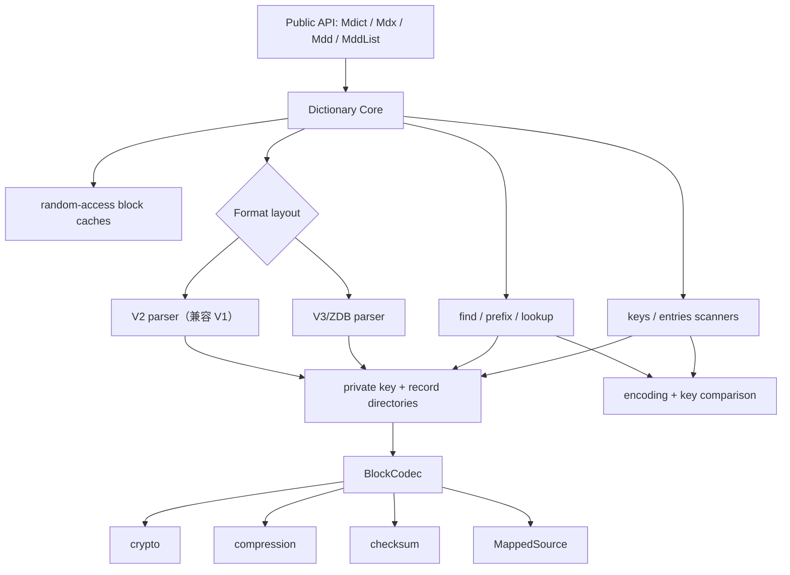

# `mdict` Rust 解析库设计

> 状态：第一版实现完成，进入真实样本扩充阶段
> 目标目录：`native/mdict`
> 目标格式：MDict v1、MDict v2、MDict v3

## 1. 背景

前期实现已经验证了 mmap、流式 key 扫描、逻辑 record
offset、跨 Record Block 读取和 Node 批量导入等关键方案，但它们都以某一次产品需求为中心，格式层、查询层和对外 API 的边界仍不够稳定。

新版库从公开 Rust 解析库的角度重新设计，不兼容旧接口。它应当同时适合作为：

- 普通 Rust 程序的 MDict 解析依赖；
- Dictol 的底层解析核心；
- Node/N-API binding 的稳定基础；
- `mdict` 命令行检查工具的实现；
- 后续全文索引、SQLite 索引或其他搜索系统的数据来源。

设计参考：

- `docs/mdict-format-v2.md` 中的 v2 逆向格式说明；
- `raymanzhang/mdx` 对 v1/v2/v3、ZDB、加密和 MDD 分卷的实现；
- `opendict-rs` 对 v1/v2/v3 的兼容实现；
- 前期实现已验证的 mmap、扫描器与跨 block record 读取逻辑。

`raymanzhang/mdx` 使用 AGPL-3.0。本项目只把它作为行为和格式研究资料；除非未来明确接受相应许可证，否则不得直接复制其实现代码。

## 2. 已确定的设计决策

1. 核心库同时支持 v1、v2 和 v3；v1 通过 v2 parser 的兼容分支读取，v3 保持独立布局。
2. 对外提供 `Mdict` 主入口，同时提供语义更明确的 `Mdx`、`Mdd`、`MddList` 入口。
3. `Mdict` 只负责一份物理 MDX/MDD 文件的基础读取、查找和遍历；`Mdx`、`Mdd` 通过组合 `Mdict` 增加类型特异功能，`MddList` 组合多份 `Mdd`。
4. Header、Key/Record Section、v3 Unit、Block Index 等物理结构全部保持私有。
5. 对外位置统一使用 `record_start`、`record_end` 这两个解压后逻辑 offset，不暴露 Record Block 下标或物理文件位置。
6. 文件数据源使用只读 mmap；物理范围在建立私有 descriptor 时集中检查一次，热路径直接使用已经验证的范围。
7. 随机查询使用按解压字节数限制的 Key Block / Record Block LRU。
8. `entries()` 保持顺序游标方案，不接入、也不污染随机查询 LRU。
9. 解密、解压、校验、字符编码分别放在独立模块。
10. key 使用严格解码；MDX record 文本使用 `encoding_rs` 容错解码；MDD record 始终作为二进制。
11. 核心 crate 不包含 FST、FTS、SQLite、`.locations` 或任何持久化旁路索引。
12. CLI 与 library 一起发布；N-API binding 保持在核心库之外。
13. 不需要兼容前期实现或现有 Node binding 的旧 API。
14. 只保留内存安全、解压安全和格式解码必需的检查；同一个范围、大小或计数不能在多层代码中重复检查。
15. 缺少真实 v1/v3 词典时，这两个版本的具体格式行为以固定 commit 的 `raymanzhang/mdx` 为兼容基线。
16. `Mdx` 第一版即处理 `@@@LINK=` 和 Compact/StyleSheet 展开；基础 `Mdict` 始终返回原始 record bytes。
17. 同一组 MDD 分卷必须使用相同格式版本，不支持 v1/v2/v3 混合分卷。

## 3. 范围与非目标

### 3.1 第一阶段必须支持

- MDict v1、v2、v3 的 MDX 和 MDD；
- v1/v2 共用解析主流程，并正确处理整数宽度、索引包装和 key descriptor 差异；
- v2 无加密、Key Index 简单加密以及 `RegCode + user_id` 加密；
- v3 UUID 派生密钥和 v3 Storage Block 加密；
- None、LZO、zlib，以及真实 v3 文件使用的其他压缩算法；
- UTF-8、UTF-16LE、GBK/GB18030、Big5 等 `encoding_rs` 可处理编码；
- 精确查词、重复 key、前缀查询；
- 流式遍历 key；
- 流式遍历 key 与 record；
- 按逻辑范围读取 record，包括横跨多个 Record Block；
- `@@@LINK=` 重定向；
- 多分卷 MDD；
- 格式校验、资源限制和结构化错误；
- CLI 检查和提取命令。

### 3.2 不属于核心解析器

- 写入、打包或修改 MDX/MDD；
- FST/FTS 全文索引；
- SQLite 导入和查询；
- HTML DOM 修改、资源 URL 重写和 Electron 协议；
- 词形还原、模糊查询、glob 查询；
- 图片、音频等资源的 MIME 检测；
- 磁盘资源缓存；
- Node 对象与 Rust 对象的批量转换策略。

这些能力可以建立在公开的 `keys()`、`entries()`、`find_key()` 和 `read_record()` 之上，但不能反向进入格式层。

## 4. 概念模型

MDX 和 MDD 在核心层都被视为有序的 key/record 集合：

```text
key ──→ record 在“全部 Record Block 解压并串联”后的逻辑范围
         [record_start, record_end)
```

物理位置只用于内部读取：

```text
逻辑 record offset
        │
        ▼
私有 RecordDirectory 二分定位
        │
        ▼
压缩 block 的文件物理范围
        │
        ▼
mmap slice → 解密 → 解压 → 校验 → 截取 record
```

公开 API 不需要知道某个 record 属于哪个 Record Block。这样 v1、v2 和 v3 可以共享相同的查询与遍历模型。

## 5. 总体架构



核心原则：

- v2/v3 parser 只负责把不同磁盘布局解析为统一的私有目录；
- 查询、遍历、record 拼接只依赖统一目录，不散落版本判断；
- BlockCodec 知道如何解释 v2/v3 的 block envelope，但不知道什么是“查词”；
- 公共对象看不到 section、unit、block index 等格式细节。

## 6. 建议目录结构

```text
native/mdict/
├── Cargo.toml
├── README.md
├── docs/
│   └── design.md
└── src/
    ├── lib.rs
    ├── main.rs                 # mdict CLI
    ├── mdict.rs                # 单物理文件公共入口
    ├── mdx.rs                  # MDX 文本语义包装
    ├── mdd.rs                  # MDD 分卷集合与资源查找
    ├── model.rs                # 精简公共模型
    ├── options.rs              # OpenOptions、Limits、Credentials、CacheOptions
    ├── error.rs                # 公共错误类型
    ├── source.rs               # MappedSource 与安全范围读取
    ├── encoding.rs             # encoding_rs、key 严格解码、record 容错解码
    ├── comparison.rs           # v1/v2 规范化与 v3 locale collation
    ├── cache.rs                # 按解压字节数限制的 block LRU
    ├── scanner.rs              # Keys、Entries 和顺序 block 游标
    ├── record.rs               # 随机 record 定位、跨 block 拼接
    ├── block/
    │   ├── mod.rs              # BlockCodec 与统一解码入口
    │   ├── envelope_v2.rs
    │   ├── envelope_v3.rs
    │   ├── compression.rs
    │   ├── crypto.rs
    │   └── checksum.rs
    └── format/
        ├── mod.rs              # Header 后的版本分派
        ├── header.rs
        ├── directory.rs        # 私有统一 Key/Record block 描述
        ├── v2.rs               # v2 parser，兼容 v1
        └── v3.rs
```

初始实现不应继续拆分成大量只有几十行的小文件。只有当 `v2.rs` 或 `v3.rs` 明确出现多个独立解析阶段时，再在对应版本目录内拆分。

## 7. 对外 API

以下签名是第一版 API 目标，不承担旧接口兼容义务。具体生命周期参数可在实现阶段根据迭代器设计调整。

### 7.1 公共数据类型

```rust
pub enum FileKind {
    Mdx,
    Mdd,
}

pub enum Version {
    V1,
    V2,
    V3,
}

pub struct Metadata {
    pub kind: FileKind,
    pub version: Version,
    pub engine_version: String,
    pub encoding: String,
    pub title: String,
    pub description: String,
    pub format: String,
    pub encryption: EncryptionSummary,
    pub entry_count: u64,
    pub key_block_count: u64,
    pub record_block_count: u64,
    pub attributes: BTreeMap<String, String>,
    pub warnings: Vec<Warning>,
    pub raw_header: String,
}

pub struct EncryptionSummary {
    pub encrypted: bool,
    pub credentials_required: bool,
    pub description: String,
}

pub struct Key {
    pub text: String,
    pub record_start: u64,
    pub record_end: u64,
}

pub struct Entry {
    pub key: String,
    pub data: Vec<u8>,
}
```

`Key` 保持为三个直观字段，不引入 `ByteRange`、`RecordLocation` 或 `first_record_block`。物理 block 定位始终由打开后的对象完成。

`EncryptionSummary` 只描述调用方关心的语义，不把 v2 bit flag 或 v3 block nibble 暴露成公共格式结构；原始 Header 属性仍可从 `attributes` 查看。

### 7.2 `Mdict`：一份物理文件

```rust
impl Mdict {
    pub fn open(paths: Vec<impl AsRef<Path>>) -> Result<Self>;
    pub fn open_with_options(
        paths: Vec<impl AsRef<Path>>,
        options: OpenOptions,
    ) -> Result<Self>;

    pub fn path(&self) -> &Path;
    pub fn kind(&self) -> FileKind;
    pub fn metadata(&self) -> &Metadata;

    pub fn keys(&self) -> Keys<'_>;
    pub fn entries(&self) -> Entries<'_>;
    pub fn find_key(&self, key: &str) -> Result<Option<Key>>;
    pub fn find_keys(&self, key: &str) -> Result<Vec<Key>>;
    pub fn prefix(&self, prefix: &str) -> Result<Prefix<'_>>;

    pub fn read_record(&self, record_start: u64, record_end: u64) -> Result<Vec<u8>>;
    pub fn lookup(&self, key: &str) -> Result<Option<Entry>>;
}
```

- `find_key()` 返回排序意义上的第一个精确匹配；
- `find_keys()` 返回所有规范化后相等的重复 key；
- `prefix()` 使用流式迭代器，避免空前缀或常见前缀一次分配巨大 `Vec`；
- `lookup()` 等于 `find_key() + read_record()`；
- `keys()` 和 `entries()` 都按文件原始 key 顺序返回。

### 7.3 `Mdx`：文本词典入口

```rust
impl Mdx {
    pub fn open(path: impl AsRef<Path>) -> Result<Self>;
    pub fn open_with_options(path: impl AsRef<Path>, options: OpenOptions) -> Result<Self>;
    pub fn as_mdict(&self) -> &Mdict;

    pub fn keys(&self) -> Keys<'_>;
    pub fn entries(&self) -> Entries<'_>;
    pub fn find_key(&self, key: &str) -> Result<Option<Key>>;
    pub fn find_keys(&self, key: &str) -> Result<Vec<Key>>;
    pub fn prefix(&self, prefix: &str) -> Result<Prefix<'_>>;
    pub fn lookup(&self, key: &str) -> Result<Option<Entry>>;

    pub fn read_record_text(
        &self,
        record_start: u64,
        record_end: u64,
        redirect_link: bool,
    ) -> Result<String>;

    pub fn lookup_text(&self, key: &str) -> Result<Option<String>>;
}
```

`Mdx::open()` 必须验证文件语义确实是 MDX，并解析 Header 中的 `Compact`/`Compat` 与 `StyleSheet`。`lookup_text()` 使用 `redirect_link = true`，最多跟随 16 次 `@@@LINK=`，并检测循环；获得最终目标 record 后自动执行 StyleSheet 展开。HTML URL 重写、MDD 资源解析和页面安全策略不属于该方法。

`read_record_text()` 也返回完成 StyleSheet 展开后的文本，区别只是由调用方决定是否跟随 LINK。需要完全原始内容时，使用 `Mdict::read_record()` 取得 bytes；`Mdx` 不再增加一套“半处理”文本 API。

### 7.4 `Mdd` 与 `MddList`：单文件和多文件资源入口

```rust
pub struct MddKey {
    pub volume: u32,
    pub text: String,
    pub record_start: u64,
    pub record_end: u64,
}

impl MddList {
    pub fn open(paths: Vec<impl AsRef<Path>>) -> Result<Self>;
    pub fn open_with_options(
        paths: Vec<impl AsRef<Path>>,
        options: OpenOptions,
    ) -> Result<Self>;

    pub fn volume_count(&self) -> usize;
    pub fn keys(&self) -> MddListKeys<'_>;
    pub fn entries(&self) -> MddListEntries<'_>;
    pub fn find_key(&self, key: &str) -> Result<Option<MddKey>>;
    pub fn find_keys(&self, key: &str) -> Result<Vec<MddKey>>;
    pub fn prefix(&self, prefix: &str) -> Result<MddListPrefix<'_>>;
    pub fn read_record(
        &self,
        volume: u32,
        record_start: u64,
        record_end: u64,
    ) -> Result<Vec<u8>>;
    pub fn lookup(&self, key: &str) -> Result<Option<Entry>>;
}
```

`Mdd::open(path)` 只表示一个物理文件，其 key 位置不带 `volume`。`MddList` 不自动发现文件；调用方显式传入文件集合：

```rust
MddList::open(vec![
    "dictionary.mdd",
    "dictionary.1.mdd",
    "dictionary.2.mdd",
])
```

`paths` 的顺序就是分卷优先级。每个分卷都是独立 MDict 文件；资源不能横跨两个文件。同名资源以调用方传入顺序优先。

同一 `MddList` 中的文件必须使用相同格式版本，不支持混合 v1/v2/v3。`MddList::open()` 打开各文件时确认版本与第一份文件一致，随后整组只使用一套资源路径规则。任意文件损坏或版本不一致都会返回带文件路径的错误。

### 7.5 不使用公共 trait 统一三种入口

第一版不公开 `Dictionary` trait。`Mdict`、`Mdx`、`Mdd` 使用相同的方法词汇，但 `MddList` 的多文件位置天然多一个 `volume`。强行使用公共 trait 会引入关联类型、对象安全和生命周期负担。

共享逻辑放在 crate 私有函数和内部类型中，而不是通过复杂的公开 trait 暴露。

### 7.6 四个入口的职责边界

```text
Mdict
├── Header / Metadata
├── find_key / find_keys / prefix
├── keys / entries
├── read_record
└── lookup（返回原始 bytes）

Mdx(Mdict)
├── record 文本解码
├── Compact/StyleSheet 展开
├── lookup_text
└── @@@LINK= 解析、循环检测和目标替换

Mdd(Mdict)
├── 单个物理 MDD 文件
├── 资源路径规范化
└── 二进制资源查找

MddList(Vec<Mdd>)
├── 显式文件顺序与优先级
├── 按列表版本执行资源路径规范化
└── 跨文件资源查找（返回带 volume 的位置）
```

`Mdict` 不解析 `@@@LINK=`，也不知道 record 是 HTML、图片还是音频。`Mdx` 和 `Mdd` 不重新实现 key/record 定位，只委托内部 `Mdict`；`MddList` 再委托各个 `Mdd`。这样格式基础能力只有一份实现，类型语义不会进入 layout parser。

## 8. 打开流程

```text
path
  → 打开 File
  → 建立只读 mmap
  → 解析 Header
  → 根据 Header 判断 v1/v2/v3 和 MDX/MDD
  → 解析版本专属的私有 layout
  → 建立 KeyDirectory、RecordDirectory
  → descriptor 构造时一次性确认物理范围和必要的累计大小
  → 检查 key block 边界是否适合二分查找
  → 创建空的随机查询 LRU
  → 返回 Mdict
```

扩展名用于提供错误提示和语义校验，格式版本必须从 Header 判断，不能从文件名猜测。

打开阶段只解析 Header 和轻量级 block 描述表，不解压全部 Key Block 或 Record Block。

公开 reader 目标是实现 `Send + Sync`，允许多个线程共享同一个打开实例。mmap 生命周期内，调用方不得截断、覆盖或原地替换源文件。

### 8.1 集中检查，而不是层层防御

前期实现的一个问题是：相同的范围和大小会在 parser、dictionary、scanner、codec 中反复检查，使正常读取路径被错误分支淹没。新版采用“边界处验证一次，内部信任已构造对象”的规则。

只保留三类运行时检查：

1. **解析边界**：BinaryCursor 在读取字段时确认输入仍有足够字节；私有 descriptor 构造时确认文件物理范围位于 mmap 内。
2. **解码边界**：BlockCodec 确认解压输出不超过限制，并执行格式规定的 checksum。
3. **公共输入边界**：`read_record(start, end)` 对调用方传入的逻辑范围检查一次。

完成构造后：

- `SourceSpan` 内部保存已经转换为 `usize` 的合法 `start..end`；
- `MappedSource::slice(SourceSpan)` 不再重复返回 `Result`；
- scanner 直接信任 block descriptor 的物理范围和声明 entry 数；
- 只在自然消费完一个 block 时确认解析进度，不在每个 key 上重复检查 block 总长度；
- 内部不变量用 `debug_assert!` 表达，不把不可能发生的分支铺满主流程。

checksum、解压大小限制和防越界不能关闭，因为它们直接关系到数据正确性和内存安全。重复的 cross-field 一致性检查、额外诊断和全文件完整性扫描可以由测试工具或未来独立 `verify` 功能承担，不进入普通 `open`/`lookup` 热路径。

## 9. v1/v2 与 v3 的内部边界

### 9.1 v2 parser：兼容 v1

```text
Header
Key Section Header
Key Block Info
Key Blocks
Record Section Header
Record Block Index
Record Blocks
```

v1 和 v2 的 section 顺序和核心语义相同，因此统一由 v2 parser 处理，不建立两个几乎重复的 layout。版本差异集中在 checked binary reader 和少量 descriptor parser 中：

| 项目 | v1 | v2 |
|---|---|---|
| section 数值宽度 | `u32` | `u64` |
| Key Section 参数 | 4 个整数 | 5 个整数 + checksum |
| Key Block Index 存储 | 通常是原始 index 数据 | block envelope，可压缩/加密 |
| block entry count 与 size | `u32` | `u64` |
| block 首尾 key 长度 | `u8`，不含结尾零 | `u16`，后随结尾零 |
| Key Block 中 record offset | `u32` | `u64` |
| Record Block Index size | `u32` | `u64` |

v2 parser 使用文件版本选择整数宽度和字段包装。v1 的兼容条件只能停留在 v2 格式层，不能传播到查询、遍历和 `Mdict` 公共实现。

v2 parser 负责：

- 解析 Key/Record Section 数值字段；
- 根据版本处理 Key Section 参数、checksum 和 Key Block Index 包装；
- 在 v2 中处理 Key Section Header 和 Key Block Info 加密；
- 将 block 相对大小累计成绝对物理范围；
- 将 Record Block 解压大小累计成全局逻辑范围；
- 生成统一私有目录。

v1 同样以 `raymanzhang/mdx` commit `111cab6cddb119ce35158ee1a8d641bab698c87e` 为兼容基线，不探测参考实现之外的假设变体：

- Header 长度使用 `u32 BE`；Header bytes 根据内容识别 UTF-16LE/UTF-8；Header Adler-32 按文件中的 little-endian 表示读取；
- Key Section 参数使用 4 个 `u32 BE`，没有 v2 的参数 checksum；
- Key Block Index 按原始数据读取，不套 v2 的压缩/加密 index envelope；
- Key Block descriptor 使用 `u32` entry/size、`u8` 首尾 key 长度，首尾 key 后没有 v2 terminator；
- Key Block 中 record offset 以及 Record Block Index 数值使用 `u32 BE`；
- Key/Record data block 使用 rayman 的 v2 block envelope、compression 与 checksum 路径；
- 不额外实现未经 rayman 代码定义的 v1 加密变体。

### 9.2 v3 / ZDB

```text
Header <ZDB ...>
Content Unit              (type = 1)
Content Block Index Unit  (type = 2)
Key Unit                  (type = 3)
Key Block Index Unit      (type = 4)
```

v3 parser 负责：

- 校验 Unit Type 和物理顺序；
- 解析每个 Unit 的 info、data blocks 和 data-info XML；
- 从 UUID 派生 block crypto key；
- 解析 v3 Key/Content block 描述；
- 转换为与 v2 parser 相同的私有 KeyDirectory、RecordDirectory。

### 9.3 v3 兼容基线

目前没有真实 v3 词典用于交叉验证，因此 v3 行为明确以 `raymanzhang/mdx` 当前研究版本（commit `111cab6cddb119ce35158ee1a8d641bab698c87e`）为兼容基线。其他实现与它冲突时，第一版选择 rayman 的行为；将来获得真实 v3 文件后，再用 fixture 决定是否修正。

#### UUID 派生密钥

对 Header 中 UUID 字符串的原始 UTF-8 bytes：

```text
mid = (uuid.len + 1) / 2
h1  = XXH64(uuid[0..mid], seed = 0)
h2  = XXH64(uuid[mid..],  seed = 0)
key = h1.to_be_bytes() || h2.to_be_bytes()
```

即两个 XXH64 都使用**大端序**拼接，得到 16 字节 key。UUID 为空时返回格式错误。

#### v3 Storage Block 编号与 checksum

v3 Storage Block 使用：

```text
u32 BE  original_size
u32 BE  encoded_block_size
u8      high nibble = encryption, low nibble = compression
u8      encrypted_prefix_size
u16 BE  reserved
u32 BE  adler32
bytes   payload
```

Compression method：

| 编号 | 算法 |
|---:|---|
| 0 | None |
| 1 | LZO |
| 2 | zlib/Deflate |
| 3 | LZMA |
| 4 | bzip2 |
| 5 | LZ4 |

Encryption method：

| 编号 | 算法 |
|---:|---|
| 0 | None |
| 1 | MDict simple encryption |
| 2 | Salsa20 |

存在加密时，只解密 `encrypted_prefix_size` 指定的 payload 前缀，随后对**完整的已解密压缩 payload**计算 Adler-32，再执行解压。没有加密时，先解压，再对**完整的原始数据**计算 Adler-32。两种路径最后都确认实际输出等于 `original_size`。

rayman builder 的 `RecordData.recordCount` 表示词条总数，而
`RecordIndex.recordCount` 表示 Content Block Index 条目数，即 Content Unit 的
Storage Block 数量。两者语义不同，不能执行相等校验。此差异已由 commit
`111cab6cddb119ce35158ee1a8d641bab698c87e` 生成的 Salsa20 加密 MDD fixture
确认并固化为回归测试。

#### v3 locale collation

- 将 `DefaultSortingLocale` 解析为 BCP-47 locale；
- 使用 ICU4X `CollatorPreferences::from(locale)`；
- `ks` 映射 Primary/Secondary/Tertiary/Quaternary/Identical strength；
- `ka` 映射 Shifted/NonIgnorable；
- `kc` 映射 case level；
- `co`、`kf`、`kn`、`kb` 交给 `CollatorPreferences`；
- 与 rayman 一致，ICU4X 暂不支持的 `kr`、`kv` 忽略并记录 warning；
- 空 locale 使用 ICU4X 默认 preferences/options；
- 比较直接调用 collator，不生成并按字节比较伪 sort key；
- 前缀比较先按查询词的 Unicode scalar 数截取候选 key，再执行 locale compare。

这里的“一致性”定义为与上述 rayman 行为一致，不宣称已经与官方 MDict v3 客户端交叉验证。

### 9.4 统一方式

不在 `dictionary.rs` 中散布 `if version == V1/V2`。版本 parser 完成后返回：

```rust
struct OpenedFormat {
    metadata: Metadata,
    key_directory: KeyDirectory,
    record_directory: RecordDirectory,
    key_decoder: KeyDecoderKind,
    record_decoder: RecordDecoderKind,
    comparison: KeyComparison,
}
```

这些类型全部是 crate 私有。`KeyDecoderKind` 和 `RecordDecoderKind` 可以使用 enum 静态分派；内部只有 v2 和 v3 两个 layout family，没有引入 `Box<dyn FormatReader>` 的必要。

## 10. 私有目录与关键 offset

内部 Key Block 描述至少保存：

```text
block id
entry count
first key / last key
规范化或 collation 边界
压缩 block 的文件 start/end
预期解压大小
首个逻辑 entry number（如 v3 定位需要）
```

内部 Record Block 描述至少保存：

```text
block id
压缩 block 的文件 start/end
解压后逻辑 start/end
版本专属 envelope 信息（仅在确实能提前获得时）
```

目录构造器统一使用 `checked_add`，并把物理 offset 转换成一次性验证过的私有 `SourceSpan`。后续查询和解码不再重复比较 mmap 长度。会影响安全定位的逻辑范围倒置必须立即失败；纯冗余的 cross-field 统计一致性留给测试或完整验证工具。

## 11. Key 扫描与 record 范围

Key Block 中保存 key 和 record 起始 offset。扫描器使用一条跨 block 的 lookahead：

```text
current.record_start = 当前 key 的 offset
current.record_end   = 下一个 key 的 offset
最后一条的 end      = record 逻辑数据总长度
```

扫描器一次只持有：

- 一个解压后的 Key Block；
- 当前 cursor；
- 当前 block 剩余 entry 数；
- 一个待输出 key。

扫描器只处理与正确推进直接相关的条件：

- record offset 单调不下降；
- key 终止符存在；
- key 编码合法；
- 实际产生的 entry 数不超过 descriptor 声明；
- record offset 不超过 record 逻辑总长度。

这些检查由 BinaryCursor 和扫描器状态转换集中完成，不能在 `keys()`、`entries()`、`find_key()` 三条调用链中分别复制。

重复 key 不能去重，必须按文件顺序全部返回。按照 rayman 的
`get_content_length(entry_no) = next_offset - current_offset` 行为，相邻 key 使用
相同 record offset 时，前一条得到空 record，后一条继续使用到下一个 offset 的
范围；最后一条使用 record 逻辑总长度。该行为已经建立合成 fixture。

## 12. 查词与前缀查询

### 12.1 block 级候选定位

打开时验证 Key Block 比较边界是否单调。满足条件时：

```rust
let start = blocks.partition_point(|block| block.last_key < query);
```

然后从 `start` 向后扫描所有仍可能与 query 重叠的 block。不能只检查一个 block，因为 `StripKey`、大小写规则、locale collation 和重复 key 都可能让相邻 block 的比较范围重叠。

如果边界不单调，则回退到完整 block 描述表扫描。回退只会扩大候选集，不允许漏 key。

### 12.2 block 内查找

- 随机 `find_key()` 可以解压候选 Key Block 后执行块内二分；
- 若实际 key 比较结果不满足单调性，则退回块内线性扫描；
- `prefix()` 从第一个候选 block 开始逐条产生结果，在确认后续 block 不可能匹配时停止；
- `find_keys()` 必须继续扫描所有相邻重叠 block，返回全部规范化相等项。

### 12.3 key 比较

v1/v2 遵循：

- `KeyCaseSensitive`；
- `StripKey`；
- 字典声明编码。

v3 遵循 `DefaultSortingLocale` 和文件使用的 locale collation。不能用普通 Rust 字符串字典序冒充 v3 排序。实现阶段优先选择 ICU4X 的 Rust crates，并用真实 v3 文件验证排序一致性。

## 13. Record 随机读取

`read_record(start, end)`：

1. 校验逻辑范围和单条 record 上限；
2. 在 RecordDirectory 中二分定位包含 `start` 的 block；
3. 从随机查询 LRU 获取解压 block；
4. 未命中时从 mmap 取压缩切片并交给 BlockCodec；
5. 复制与目标 record 相交的区间；
6. record 跨 block 时依次处理后续 block；
7. 拼接完整字节后返回。

必须先拼接完整字节再做文本解码，避免一个多字节字符刚好跨越 Record Block 时被错误替换。

## 14. `entries()` 顺序遍历

`entries()` 不对每个 key 执行一次随机 `read_record()`。它组合：

```text
KeyScanner + SequentialRecordCursor
```

`SequentialRecordCursor`：

- 第一次根据 offset 定位 Record Block；
- 此后只向后推进；
- 始终保留当前解压后的 Record Block；
- 同一 block 内所有 entries 共享这一次解压；
- 跨 block record 依次截取并拼接；
- 不查询、不写入随机 LRU。

因此单次完整遍历中，每个访问到的 Key Block 和 Record Block 原则上只解压一次。LRU 不会改善这种严格单向访问，反而会污染随机查词热点，所以遍历算法保持独立。

## 15. mmap 与随机查询 LRU

两者解决不同问题：

```text
mmap：减少压缩输入读取的系统调用、游标和复制
LRU：减少同一个 block 的重复解压
```

建议配置：

```rust
pub struct CacheOptions {
    pub key_blocks_bytes: usize,
    pub record_blocks_bytes: usize,
}
```

缓存按解压后的总字节数限制，不按 block 个数限制。缓存值使用 `Arc<[u8]>`，允许并发查询共享。容量为零时完全禁用缓存。

并发未命中同一 block 时应避免重复解压，即同一个 `(source, block_id)` 同时只允许一个解码任务执行。实现可使用分片锁或单航机制，但不能在执行耗时解压时持有全局 LRU 锁。

## 16. BlockCodec

BlockCodec 的处理顺序由版本 envelope 决定，而不是假设永远是“先解密再校验再解压”：

```text
解析 envelope
→ 根据版本和标志取得密钥
→ 解密指定 payload/前缀
→ 在版本规定的阶段校验 checksum
→ 解压
→ 校验声明解压大小
→ 必要时校验解压数据 checksum
```

模块职责：

- `envelope_v2.rs`：v2 compression type、checksum 和 payload，以及 v1 原始 index 的特殊入口；
- `envelope_v3.rs`：原始长度、编码长度、compression/encryption nibble、加密前缀长度、checksum；
- `compression.rs`：None、LZO、zlib、LZMA、bzip2、LZ4 等算法；
- `crypto.rs`：v2 simple decrypt、Salsa20/8、v3 block encryption；v1 只实现 rayman 明确定义的 v2-compatible encryption behavior，不探测其他变体；
- `checksum.rs`：Adler-32 和版本专属校验时机。

解压函数必须接收预期输出大小和 `Limits`，禁止无上限 `read_to_end()`。无压缩且未加密的 block 可以借用 mmap 切片；进入 LRU 时再转换为 `Arc<[u8]>`。

## 17. 加密与凭据

```rust
pub struct Credentials {
    pub user_id: Option<String>,
    pub reg_code: Option<String>,
}

pub struct OpenOptions {
    pub limits: Limits,
    pub cache: CacheOptions,
    pub credentials: Credentials,
}
```

行为：

- 未显式提供 `reg_code` 时，可以查找同名 `.key` 文件；
- Header 内嵌 `RegCode` 是另一个来源；
- 显式参数优先于 `.key`，`.key` 优先于 Header 内嵌值；
- v2 根据 `RegisterBy` 解释 `user_id` 是 Email 还是 DeviceID，但 API 只接收原始字符串；
- v3 默认从 Header UUID 派生 block key；
- 缺少凭据时返回 `CredentialRequired`，不能伪装成 checksum 或解压错误；
- 凭据和派生 key 不实现 `Debug`，离开作用域时尽可能清零。

v2 的 `Encrypted` 两个 bit 必须分别建模：Key Section Header 加密与 Key Block Info 加密不是同一种算法。

## 18. 文本编码、`@@@LINK=` 与 StyleSheet

- Header 按版本规定的 UTF-16LE 或 UTF-8 解码；
- Header XML 交给 `quick-xml`；
- key 使用 `encoding_rs` 严格解码，非法序列返回格式错误；
- MDX record 使用 `encoding_rs` 容错解码，保证尽可能展示内容；
- MDD record 不进行文本解码。

`@@@LINK=`：

```text
读取完整 record bytes
→ 解码文本
→ 精确识别整条 link 指令
→ find_key(target)
→ 读取目标 record
→ 最多 16 次，并维护已访问的规范化 key
→ 对最终非 LINK 文本执行 Compact/StyleSheet 展开
```

目标缺失、循环和超过深度应返回明确的 `LinkError`，而不是悄悄展示 `@@@LINK=` 原文。若产品层希望宽松处理，可以在上层选择降级。

StyleSheet 属于 `Mdx` 文本语义，不属于 `Mdict`。`Mdx::open()` 按 rayman 行为把 Header `StyleSheet` 解析为重复的三行记录：

```text
token number (0..255)
prefix
suffix
```

prefix/suffix 中的 HTML entity 在载入时解码。最终 record 中形如反引号数字 token 的 compact 片段，按照 `prefix + content + suffix` 展开。只要 StyleSheet 非空，`lookup_text()` 和 `read_record_text()` 就执行展开，不依赖 `Compact`/`Compat` 拼写是否正确。LINK 必须先解析到最终目标，再只对最终文本展开一次。

## 19. MDD 分卷

`MddList` 表示有序的物理文件集合：

```text
volume 0: dictionary.mdd
volume 1: dictionary.1.mdd
volume 2: dictionary.2.mdd
```

打开流程：

1. 使用调用方传入的路径顺序确定 volume 编号和查询优先级；
2. 每个分卷独立执行 `Mdict::open_with_options()`；
3. 校验每一卷都是 MDD，并且版本与第一卷相同；混合版本直接返回错误；
4. 查询时逐卷查找，首个匹配优先。

第一版不建立跨文件全局 key 索引。文件通常很少，顺序查找足够；未来如有基准证明需要优化，可以在 `MddList` 内部建立轻量级 volume 边界目录，而不改变公开 API。

## 20. 错误模型与安全限制

```rust
pub enum Error {
    Io { path: PathBuf, source: io::Error },
    InvalidFormat { path: PathBuf, offset: u64, context: String },
    Unsupported { feature: String },
    CredentialRequired { register_by: Option<String> },
    Crypto { offset: u64, context: String },
    Compression { offset: u64, method: String, context: String },
    Checksum { offset: u64, expected: u32, actual: u32 },
    Encoding { offset: u64, encoding: String },
    LimitExceeded { name: &'static str, actual: u64, maximum: u64 },
    Link(LinkError),
}
```

Not Found 使用 `Ok(None)`，不作为错误。

`Limits` 只覆盖无法从 mmap 长度自然约束、并可能造成异常内存分配的值：

- Header 大小；
- 解压后索引大小；
- 单个解压 block；
- 单个 record；
- block 数量；
- MDD 分卷数量。

压缩区间已经受 mmap 文件长度约束，key 大小受解压 block 大小约束，entry 数受 index 大小和 block 数约束，因此不再为它们增加一层重复 limit。link 深度使用固定的 16 次语义上限。

所有来自文件的长度先保持 `u64`，在 descriptor 构造时一次性完成范围与平台转换。普通查询和扫描只使用构造成功的值，不再反复执行同一组 `u64 → usize` 与文件长度比较。不得使用文件数据驱动的 unchecked slice 或不可控内存分配。

## 21. CLI

crate 同时构建 library 和名为 `mdict` 的 binary，CLI 使用 `clap`。保留已经确定的命令：

```text
mdict -h file.mdx             打印 Header
mdict -K file.mdx             列出全部 key、record_start、record_end
mdict -k <key> file.mdx       查询单个 key 的位置
mdict -l <key> file.mdx       查询并输出 UTF-8 文本，处理 @@@LINK=
mdict -p <prefix> file.mdx    前缀查询
mdict --prefix <prefix> file.mdx
mdict -x <key> file.mdd       将二进制资源写到 stdout
```

因为 `-h` 被用于 Header，clap 默认短 help flag 需要关闭；帮助命令保留为 `--help`。`-x` 的 stdout 只能包含资源字节，诊断信息必须写到 stderr。

CLI 只调用公开 library API，不允许直接访问私有 layout，从而同时充当 API 使用示例和集成测试。

## 22. N-API 边界

核心 crate 不依赖 `napi-rs`。未来 binding 单独包装：

- `open`、`findKey`、`lookupText`、`readRecord`；
- stateful `KeyScanner.nextBatch(size)`，减少 Rust/Node 往返；
- `Buffer` 用于 MDD 二进制资源；
- `String` 用于已经由 Rust 解码的 MDX 文本。

Node binding 的批量对象形状、BigInt 转换和异步任务不是核心 API 的设计约束。

## 23. 测试策略

### 23.1 单元测试

- checked binary reader；
- Header 编码、XML entity 和属性解析；
- v2 block envelope（兼容 v1）与 v3 block envelope；
- v3 UUID 双 XXH64 大端拼接固定向量；
- v3 compression/encryption 编号及有加密、无加密两条 checksum 路径；
- 每种压缩和加密算法的固定向量；
- checksum 正确和错误向量；
- key 比较、StripKey、大小写，以及 rayman ICU4X locale option 映射；
- RecordDirectory 边界定位；
- link 链、循环、缺失目标；
- StyleSheet 三行解析、HTML entity 和 compact token 展开。

### 23.2 合成 fixture

覆盖：

- v1/v2/v3、MDX/MDD；
- 各种编码、压缩、加密；
- 单 block、多 block、空 block；
- key 和 record 恰好位于 block 边界；
- record 横跨两个或多个 block；
- 重复 key、相同 offset、空 record、超长 record；
- Compact/Compat、空 StyleSheet、多个 token 和 LINK 目标展开；
- 单 MDD、多分卷 MDD、分卷编号空缺、重复资源；
- 截断、错误大小、错误 Unit Type、checksum 错误、非单调边界。

`raymanzhang/mdx` builder 可生成部分 v3 fixture，但它不能替代 v1/v2 fixture，也不一定生成跨 Record Block 词条。因此必须保留手工构造的最小二进制样本。builder 生成的 v3 只能证明本库与既定兼容基线一致，不能证明与官方实现一致。

### 23.3 差分测试

对同一真实语料比较：

- `raymanzhang/mdx`；
- `opendict-rs`；
- `readmdict.py` / `mdict-utils`；
- 本库。

比较 Header、entry 数、首尾和随机 key、record bytes、MDD 资源以及错误行为。v1 与 v3 以 rayman 结果为预期值；v2 的参考实现不一致时记录原始字节和各实现结果，再用真实 fixture 裁决。v3 报告须标记为“reference-compatible，尚未 official-verified”。

### 23.4 Fuzz 与损坏输入

- fuzz Header、block envelope、index descriptor 和 key scanner；
- 随机截断真实 fixture；
- 修改长度和 block type；
- 确保所有输入只返回 `Result`，不 panic、不越界、不无限分配。

## 24. 性能基准

至少记录：

- 打开耗时和常驻元数据内存；
- `keys()` 全量遍历速度与峰值内存；
- `entries()` 全量遍历速度；
- 冷缓存随机查词；
- 热 LRU 随机查词；
- 同一 Record Block 内连续查词；
- 跨 Record Block 大词条；
- 多线程并发查询；
- 多分卷 MDD 首卷/末卷命中；
- v1、v2 与 v3 的对比。

性能验收重点不是单一微基准，而是确认：

- `keys()` 不读取 Record Block；
- `entries()` 不为每个 entry 二分定位或重复解压；
- 随机查词能命中解压 Block LRU；
- mmap 和 LRU 不造成无界常驻内存。

## 25. 实施阶段

### 阶段 0：测试材料

- 固定可合法使用的真实 v1/v2/v3、MDX/MDD 语料；
- 建立加密和跨 block fixtures；
- 固定参考实现版本与差分输出。

### 阶段 1：基础设施

- crate、错误、Limits、MappedSource；
- checked binary reader；
- encoding、checksum、compression、crypto；
- Header 和版本识别。

### 阶段 2：v2 parser（兼容 v1）

- v1/v2 共享私有 layout；
- v1/v2 字段宽度与 descriptor 分支；
- keys、entries、find、prefix、read_record；
- v2 两类加密；
- MDX 文本与 link。

### 阶段 3：v3

- Unit 与 Storage Block；
- UUID key derivation；
- locale collation；
- 与 v2 layout 共用查询和扫描器。

### 阶段 4：缓存与 MDD

- 按字节 LRU 和并发单航；
- MddList 多文件；
- 随机查询和分卷基准。

### 阶段 5：CLI 与绑定

- 完成 `mdict` CLI；
- 再建立 N-API crate；
- Dictol 切换并执行端到端回归。

每个阶段都必须先通过合成、真实语料和损坏输入测试，再进入下一阶段。

## 26. 仍需扩充的真实样本

v1 格式细节以及 v3 UUID、Storage Block、locale collation 均已决定以 rayman 实现为基线；MDD 分卷不支持混合版本；StyleSheet 在第一版 `Mdx::lookup_text()` 和 `read_record_text()` 中展开。当前已经完成：

- 两份真实 v2 MDX、一组四卷真实 v2 MDD 回归；
- v1/v2/v3 手工合成 fixture；
- rayman builder 生成的 Salsa20 加密 v3 MDD 互操作 fixture；
- v2 两个 Key Section 加密 bit 的注册凭据合成 fixture；
- 相同 offset、空 record 和跨 Record Block 合成 fixture。

仍需在获得文件后补充：

1. v2 `Encrypted & 1` 的真实 RegCode、Email、DeviceID 样本。
2. 真实 v1 MDX/MDD 样本。
3. 官方 MDict 生成的真实 v3 MDX/MDD，用于补充 reference-compatible 之外的交叉验证。
4. 真实文件中跨 Record Block 词条的存在形式。

这些项目应当形成独立 fixture 和决策记录。验证前可以建立接口边界，但不能把未经确认的算法写成稳定公共行为。

## 27. 第一版完成标准

第一版可以宣布完成，需要同时满足：

- v1/v2 的真实 MDX/MDD、rayman builder 生成的 v3 MDX/MDD，以及 v2/v3 加密样本均可打开；
- `keys()` 与参考结果条目数、顺序和 offset 一致；
- `entries()` 每个 block 只顺序解压一次，并正确处理跨 block record；
- `find_key()`、`find_keys()` 和 `prefix()` 不因重叠 block、StripKey 或 collation 漏结果；
- 随机查询缓存有可重复的命中测试和字节容量上限；
- 多分卷 MDD 的发现、优先级和路径规范化有测试；
- `Mdx::lookup_text()` 对 LINK 和 StyleSheet 的处理顺序有测试；
- 所有校验和、加密和压缩分支有固定测试向量；
- fuzz 和截断样本不触发 panic；
- CLI 全部命令只通过公开 API 工作；
- rustdoc 能让外部用户在不理解 MDict 物理 section 的情况下完成打开、查词、遍历和资源提取。
